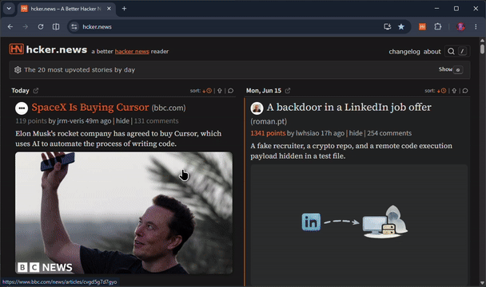

# hcker.news previews

A Chrome Extension (Manifest V3) for [hcker.news](https://hcker.news/) that adds polished story previews without getting in the way.

- 16:9 story thumbnail on each item
- favicon before the title
- OG/meta description line under the title
- hover preview card
- click-to-open lightbox with zoom controls
- on-site toggle + size control



## Highlights

- Uses the YAHNC API to map HN item IDs to images
- Prefers remote `og:image` URLs when available
- Falls back to a stored screenshot only when needed
- Dedupe-safe and idempotent for infinite scroll / client navigation
- Gracefully hides missing or broken images

## Install

### Load unpacked

1. Open `chrome://extensions`
2. Enable **Developer mode**
3. Click **Load unpacked**
4. Select this repository
5. Open [hcker.news](https://hcker.news/)

## Settings

Open the extension’s options page to configure:

- **Enable thumbnails**
- **API base URL**

Settings sync via `chrome.storage.sync` and apply live.

## Keyboard

- <kbd>I</kbd> — toggle thumbnails
- <kbd>Esc</kbd> — close the lightbox

## Development

Run the DOM helper tests:

```bash
node --test test/dom.test.mjs
```

## Notes

- Backend API: `https://hn-clone.is-ai-good-yet.com`
- Icons in `icons/` are placeholders and should be replaced before release
